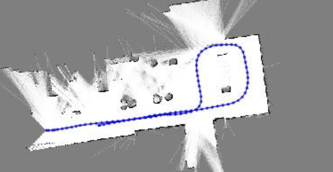
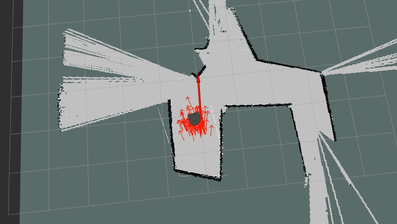
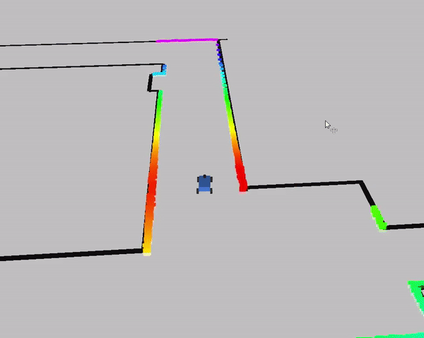
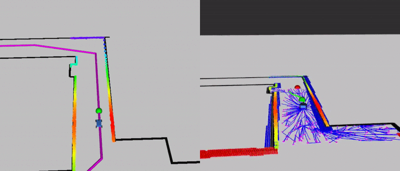

# F1TENTH RoboRacer Project | F1TENTH RoboRacer Projekt

<table>
<tr>
<td width="50%">

## Introduction

The F1TENTH RoboRacer project is an autonomous racing initiative at Széchenyi István University. This project aims to develop and implement autonomous driving algorithms on 1:10 scale racing cars, combining robotics, control theory, and artificial intelligence.

</td>
<td width="50%">

## Bevezetés

Az F1TENTH RoboRacer projekt a Széchenyi István Egyetem autonóm versenyzési kezdeményezése. A projekt célja autonóm vezetési algoritmusok fejlesztése és implementálása 1:10 méretarányú versenyautókon, ötvözve a robotikát, irányításelméletet és mesterséges intelligenciát.

</td>
</tr>
</table>

<table>
<tr>
<td width="50%">

## Project Components

### SLAM (Simultaneous Localization and Mapping)
The project uses SLAM algorithms to create maps of the racing environment and locate the vehicle within this map in real-time.

### Localization
Precise localization techniques allow the vehicle to determine its position on the track with high accuracy using sensor fusion from LiDAR, IMU, and wheel encoders.

### Reactive Algorithms
Implementation of reactive control algorithms like follow-the-gap, pure pursuit, and wall following for obstacle avoidance and path tracking.

### Bringup
System startup procedures and configurations necessary for initializing all components of the autonomous racing car.

### Global Planning
Path planning algorithms that determine the optimal racing line and trajectory planning for achieving the fastest lap times.

</td>
<td width="50%">

## Projekt Komponensek

### SLAM (Egyidejű Lokalizáció és Térképezés)
A projekt SLAM algoritmusokat használ a versenykörnyezet feltérképezésére és a jármű valós idejű lokalizálására a térképen.

### Lokalizáció
Precíziós lokalizációs technikák lehetővé teszik, hogy a jármű nagy pontossággal határozza meg pozícióját a pályán, LiDAR, IMU és kerék enkóderek adatainak fúziójával.

### Reaktív Algoritmusok
Reaktív vezérlési algoritmusok implementálása, mint például a follow-the-gap, pure pursuit és falkövető módszerek az akadályok elkerülésére és pályakövetésre.

### Bringup
Rendszerindítási eljárások és konfigurációk, amelyek szükségesek az autonóm versenyautó összes komponensének inicializálásához.

### Globális Tervezés
Útvonaltervező algoritmusok, amelyek meghatározzák az optimális versenyvonalat és a trajektória tervezést a leggyorsabb köridők elérése érdekében.

</td>
</tr>
</table>

<table>
<tr>
<td width="50%">

## Getting Started

1. **Hardware Setup**: Configure the F1TENTH car with all required sensors and motor controller
2. **Software Installation**: Install ROS and clone necessary packages
3. **Environment Setup**: Prepare the development environment

Check our [detailed documentation](https://f1tenth.readthedocs.io/en/foxy_test/) for step-by-step instructions.

</td>
<td width="50%">

## Kezdeti lépések

1. **Hardver beállítás**: F1TENTH autó konfigurálása a szükséges szenzorokkal és motorvezérlő
2. **Szoftver telepítés**: ROS és szükséges csomagok telepítése klónozása
3. **Környezet beállítás**: Fejlesztői környezet előkészítése

Nézd meg a [részletes dokumentációt](https://f1tenth.readthedocs.io/en/foxy_test/) a lépésenkénti útmutatókért.

</td>
</tr>
</table>

<table>
<tr>
<td width="50%">

## Learning Resources

To learn the fundamentals of ROS, sensor technology, and Linux basics required for this project, visit our comprehensive course materials at:

[https://sze-info.github.io/ajr/](https://sze-info.github.io/ajr/)

This resource provides tutorials, examples, and exercises to help you master the necessary skills for the F1TENTH project.

</td>
<td width="50%">

## Tanulási források

A projekthez szükséges ROS, szenzortechnológiai és Linux alapok elsajátításához látogass el az átfogó kurzusanyagainkhoz:

[https://sze-info.github.io/ajr/](https://sze-info.github.io/ajr/)

Ez a forrás oktatóanyagokat, példákat és gyakorlatokat biztosít, amelyek segítenek elsajátítani az F1TENTH projekthez szükséges készségeket.

</td>
</tr>
<table>
<tr>
<td width="50%">

## Contact

For questions and support, contact:
- Email: szonyi.balazs@hallgato.sze.hu

</td>
<td width="50%">

## Kapcsolat

Kérdésekkel és támogatásért fordulj hozzánk:
- Email: szonyi.balazs@hallgato.sze.hu

</td>
</tr>
</table>

<table>
<tr>
<td width="50%">

## License

This project is licensed under the MIT License - see the LICENSE file for details.

</td>
<td width="50%">

## Licenc

Ez a projekt az MIT licenc alatt áll - a részletekért lásd a LICENSE fájlt.

</td>
</tr>
</table>